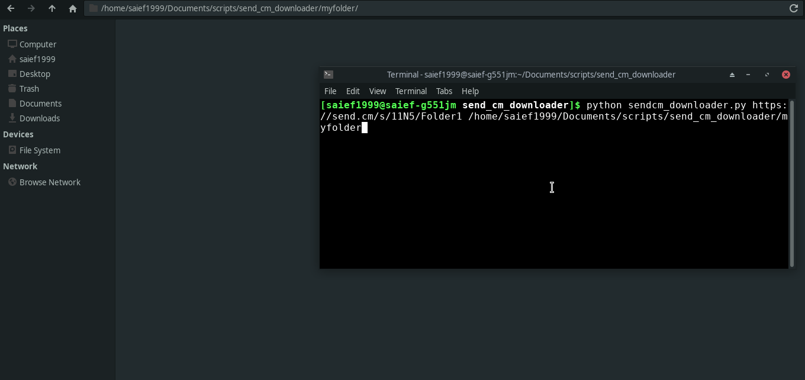

# Sendcm Folder Downloader

## READ FIRST

This repositorty has been archived. `Send.cm` started using `Cloudflare` Which prevents web scrapers (such as this one) from properly working. However, There are still cloudflare bypassers out there. Use them at your own risk!

## Overview

<a href="https://colab.research.google.com/github/Saief1999/sendcm-downloader/blob/main/Colab.ipynb" target="_parent"></a>

A small tool that gives you the ability to download whole folders from `send.cm`



## Prerequisites

Make sure you have installed all of the following prerequisites on your machine:

- Python
- Python packages :
  - Requests : `pip install requests`
  - Beautiful Soup :  `pip install bs4`
  - Clint : `pip install clint`
  - Lxml Parser: `pip install lxml`

Or simply install all requirements by running:

```bash
pip install -r requirements.txt
```

## Usage

```bash
python sendcm_downloader.py [folder_link] [local_path] {--noprogress}
```

- `folder_link`: The Folder URL
- `local_path` [Optional] : the folder you want to save your files in, defaults to the current folder
- `--noprogress` [Optional] : If, for some reason, you don't want to show the progress of downloading the files

### Copying files into Google Drive

The google colab link ( provided above ) makes it possible to copy all the files from a send.cm folder into your own Google Drive account.

The advantage of this method is that all the heavy lifting will be done via Google Collab. You won't be limited by your own network speed.

1. Mount your GDrive account
2. Run the Code block to initialize the downloader
3. Input your folder link and your Drive destination link
